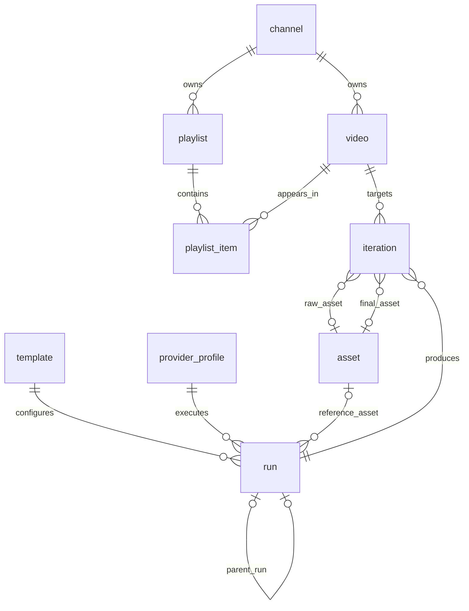
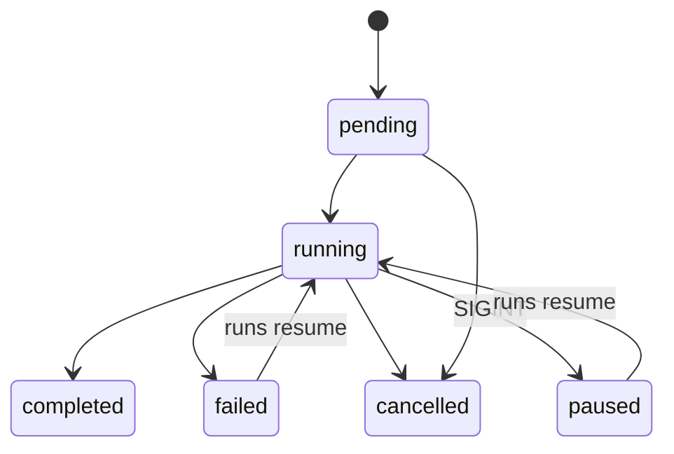

# thumbforge — Project Plan

> Planning document. No implementation exists yet. Working name `thumbforge`; see `OPEN_QUESTIONS.md` D1 for the naming decision.

## 1. Executive summary

`thumbforge` is a Typer + Rich CLI that turns a YouTube video or playlist URL into a set of consistent, spec-compliant thumbnails. You generate a **hero** thumbnail for one video with several iterations, pick and refine one, then use it as the style reference to **batch**-generate every video in a playlist with deterministic titles and "Part N" badges. Video, playlist and channel metadata come from `yt-dlp` (no API key). Image generation is behind a pluggable `ImageProvider` protocol; the first real provider drives the **Antigravity CLI (`agy`)** headlessly, and a deterministic **FakeProvider** keeps tests and offline development honest. Everything — channels, playlists, videos, templates, runs, iterations, assets — lives in a local SQLite database, with generated images stored content-addressed on disk.

Name candidates: **`thumbforge`** (recommended), `heroframe`, `stillcast`.

Stack: Python 3.14 · uv · Typer · Rich · pydantic-settings/TOML · platformdirs · SQLite via SQLAlchemy 2.0 + Alembic · yt-dlp · Jinja2 · Pillow · structlog · ruff · pyright · pytest · pre-commit · prettier (Markdown/YAML/JSON) · zensical (docs site) · graphify (agent knowledge graph).

Core design bet: **AI paints the background; Pillow renders the text.** Titles and "Part N" are composited deterministically over provider art, so batch consistency does not depend on a model's text rendering (ADR 0008).

Phase 0 is infrastructure only — the repo is built primarily by coding agents, so `AGENTS.md`, CI, ADRs, specs and the graphify knowledge graph come before any feature code.

## 2. Architecture

### 2.1 Package layout (src layout)

```
src/thumbforge/
  __init__.py            # __version__ via importlib.metadata
  __main__.py
  cli/                   # Typer apps only; no business logic
    app.py               # root Typer; registers sub-apps; global --json/--verbose/--config
    fetch.py video.py playlist.py thumb.py batch.py template.py provider.py runs.py config.py db.py
    _render.py           # Rich tables/panels/progress; image preview helper
    _errors.py           # ThumbforgeError -> exit code mapping (single handler)
  core/                  # pure domain: models + services; no I/O imports
    models.py            # Pydantic v2 models: VideoMeta, PlaylistMeta, ChannelMeta, GenerationRequest, GenerationResult, RunSpec
    errors.py            # ThumbforgeError hierarchy (see §7)
    ids.py               # idempotency-key + content-hash helpers
    services/hero.py services/batch.py services/iterate.py services/compliance.py
  providers/
    base.py              # ImageProvider Protocol, ProviderCapabilities, ProviderInfo
    registry.py          # entry-point discovery (group "thumbforge.providers") + builtin map
    fake.py              # FakeProvider
    antigravity.py       # AntigravityProvider (subprocess adapter; wrapper prompt is a
                         # module constant, not a packaged .j2 — no template engine needed)
  sources/
    base.py              # MetadataSource Protocol
    ytdlp.py             # YtDlpSource
    youtube_api.py       # YouTubeDataApiSource (Phase 8, optional extra)
  storage/
    db.py                # engine/session factory; SQLite pragmas (WAL, foreign_keys=ON)
    models.py            # SQLAlchemy 2.0 declarative ORM
    repositories.py      # one repo class per aggregate
    assets.py            # AssetStore: content-addressed files
    migrations/          # Alembic env + versions/
  templates/
    loader.py schema.py render.py builtin/   # builtin/*.toml + *.j2
  imaging/
    overlay.py           # text overlay (title, Part N) with Pillow
    fit.py               # resize/crop to 16:9 target
    compliance.py        # YouTube spec check
    fonts.py             # font resolution; bundled fallback font
  settings.py            # pydantic-settings; TOML at platformdirs user_config_dir
  logging.py             # structlog configuration; console renderer for humans, JSON renderer when --json
```

### 2.2 Dependency rule

`cli → core, storage, providers, sources, templates, imaging`; `core → no other internal package`; `providers/sources/storage/templates/imaging → core`; nothing imports `cli`.

`core` is one layer: its modules may import each other (`core.models → core.enums`, services `→ core.models`), while `core.enums`, `core.errors` and `core.ids` stay leaves that import nothing from `core`. Cross-package purity and the leaf rule are separate import-linter contracts.

Enforced by an `import-linter` contract added in Phase 1 (`uv add --dev import-linter`). A PR that violates a contract fails CI.

### 2.3 Batch run data flow

```mermaid
flowchart LR
    CLI[cli/batch.py] --> BS[core.services.batch.BatchService]
    BS --> MS[MetadataSource<br/>sources/ytdlp.py]
    BS --> TR[TemplateRenderer<br/>templates/render.py]
    BS --> SEM{{asyncio.Semaphore<br/>min(--concurrency, max_concurrency)}}
    SEM --> IP[ImageProvider<br/>providers/*]
    IP --> OV[Overlay<br/>imaging/overlay.py]
    OV --> CC[Compliance<br/>imaging/compliance.py]
    CC --> AS[AssetStore<br/>storage/assets.py]
    AS --> RR[RunRepository<br/>storage/repositories.py]
    RR --> DB[(SQLite)]
```

## 3. Data model

All primary keys are `TEXT` ULIDs unless stated. Every table has `created_at` and `updated_at` (ISO-8601 UTC text). JSON columns are `TEXT` holding JSON.



| Entity             | Columns                                                                                                                                                                                                                                                                                                                                                         | Notes                                                                                                                        |
| ------------------ | --------------------------------------------------------------------------------------------------------------------------------------------------------------------------------------------------------------------------------------------------------------------------------------------------------------------------------------------------------------- | ---------------------------------------------------------------------------------------------------------------------------- |
| `channel`          | `id`, `youtube_id UNIQUE`, `title`, `url`, `source`, `fetched_at`                                                                                                                                                                                                                                                                                               | `source` ∈ `ytdlp`, `api`                                                                                                    |
| `playlist`         | `id`, `youtube_id UNIQUE`, `channel_id FK`, `title`, `description`, `url`, `item_count`, `fetched_at`                                                                                                                                                                                                                                                           |                                                                                                                              |
| `video`            | `id`, `youtube_id UNIQUE`, `channel_id FK`, `title`, `description`, `duration_s`, `published_at`, `url`, `source_thumbnail_url`, `fetched_at`                                                                                                                                                                                                                   |                                                                                                                              |
| `playlist_item`    | `id`, `playlist_id FK`, `video_id FK`, `position INT`, `part_number INT NULL`, `part_label TEXT NULL`, `UNIQUE(playlist_id, video_id)`, `UNIQUE(playlist_id, position)`                                                                                                                                                                                         | `part_number` defaults to `position` (1-based, so the first video is "Part 1" as in §5.3); overridden by `playlist renumber` |
| `template`         | `id`, `name`, `version INT`, `prompt_template TEXT`, `layout_spec_json TEXT`, `spec_hash TEXT`, `is_builtin BOOL`, `UNIQUE(name, version)`                                                                                                                                                                                                                      | Immutable per version; editing creates `version + 1`. `spec_hash = sha256(prompt_template + canonical_json(layout_spec))`    |
| `provider_profile` | `id`, `name UNIQUE`, `provider_key`, `provider_version`, `params_json`, `created_at`                                                                                                                                                                                                                                                                            | Snapshot of provider identity + parameters used by a run. **Never stores secrets.**                                          |
| `run`              | `id`, `kind CHECK IN ('hero','iterate','batch')`, `status CHECK IN ('pending','running','paused','completed','failed','cancelled')`, `template_id FK`, `provider_profile_id FK`, `video_id FK NULL`, `playlist_id FK NULL`, `reference_asset_id FK NULL`, `parent_run_id FK NULL`, `params_json`, `started_at`, `finished_at`, `error_text NULL`                | `video_id` set for `hero`/`iterate`; `playlist_id` set for `batch`                                                           |
| `iteration`        | `id`, `run_id FK`, `video_id FK NULL`, `ordinal INT`, `idempotency_key TEXT UNIQUE`, `status` (same enum as run), `prompt_text`, `seed INT NULL`, `raw_asset_id FK NULL`, `final_asset_id FK NULL`, `picked BOOL DEFAULT 0`, `provider_request_json`, `provider_response_json`, `started_at`, `finished_at`, `duration_ms`, `cost_json NULL`, `error_text NULL` | One row per generated image attempt slot; `raw` = provider output, `final` = after overlay + fit                             |
| `asset`            | `id`, `sha256 UNIQUE`, `rel_path`, `mime`, `width`, `height`, `bytes`, `kind CHECK IN ('raw','final','reference','preview')`, `compliant BOOL NULL`, `compliance_report_json NULL`                                                                                                                                                                              | Content-addressed; see §3.2                                                                                                  |

### 3.1 How a batch run links to its hero

1. `thumb generate` creates a `run(kind='hero', video_id=V)` with N `iteration` rows.
2. `thumb pick <run> <ordinal>` sets `iteration.picked = 1` on exactly one iteration of that run and `0` on the others. `run.reference_asset_id` is **not** used for hero runs.
3. `batch <playlist> --hero <run|iteration>` creates `run(kind='batch', playlist_id=P, parent_run_id=<hero run id>, reference_asset_id=<picked iteration>.final_asset_id)`. Passing `--reference raw` uses `raw_asset_id` instead (background art without overlay text — preferred when the provider might copy the hero's title text).
4. Each batch `iteration` receives the reference asset's absolute path in `GenerationRequest.reference_images`.
5. Deleting a hero run while any batch run references it is refused (`ON DELETE RESTRICT` on `run.parent_run_id` and `run.reference_asset_id`).

### 3.2 Asset store

- Layout: `<data_dir>/assets/<sha256[:2]>/<sha256>.<ext>`; `asset.rel_path` is relative to `data_dir` so the data directory is relocatable.
- Write path: write to `<data_dir>/tmp/<ulid>`, `fsync`, compute sha256, `rename` into place. Identical bytes dedupe to the same row.
- `AssetStore.verify(asset)` re-hashes the file and reports drift.

## 4. Provider interface

The Protocol and the models below live in **`core/providers.py`**, and `JsonValue` in
`core/json.py`. ADR 0010 says `providers/base.py`; that placement does not survive the
layering rule, because `core.services` consumes these types (`HeroService` builds a
`GenerationRequest`) and `core` may not import `providers`. `phase-1-skeleton.md`
pre-authorised the move: _"the contract is the rule, the file placement bends."_ ADR 0010 is
Accepted and so is left as written; `providers/` holds the registry and the adapters.

`supports_aspect_ratio` means the requested ratio _influences_ the result, not that the exact
width and height are honoured — spike S3 measured Antigravity returning 1376x768 regardless.

```python
class ProviderCapabilities(BaseModel, frozen=True):
    supports_reference_image: bool
    supports_seed: bool
    supports_negative_prompt: bool
    supports_aspect_ratio: bool
    max_batch: int            # images per call; 1 for Antigravity
    max_concurrency: int      # provider-side safe parallelism; 2 for Antigravity (spike S7)
    output_formats: frozenset[str]   # {"jpeg"} for Antigravity

class ImageProvider(Protocol):
    key: ClassVar[str]        # "antigravity", "fake"
    capabilities: ProviderCapabilities
    async def info(self) -> ProviderInfo          # name, version string, auth state
    async def healthcheck(self) -> HealthReport   # binary found, auth ok, model list
    async def generate(self, req: GenerationRequest, *, workdir: Path) -> GenerationResult
```

```python
class GenerationRequest(BaseModel, frozen=True):
    prompt: str
    negative_prompt: str | None
    width: int
    height: int
    reference_images: tuple[Path, ...]
    seed: int | None
    params: dict[str, JsonValue]
    idempotency_key: str


class GenerationResult(BaseModel, frozen=True):
    image_path: Path
    provider_key: str
    provider_version: str
    model: str | None
    seed_used: int | None
    duration_ms: int
    cost: Cost | None  # Cost(tokens_in, tokens_out, credits: Decimal | None, currency: str | None)
    raw_response: dict[str, JsonValue]
```

### 4.1 Registry and plugins

- Builtin map `{"fake": FakeProvider, "antigravity": AntigravityProvider}` is merged with `importlib.metadata.entry_points(group="thumbforge.providers")`. The entry-point **name** is the provider key; the value is an `ImageProvider` class whose `__init__` takes its config mapping.
- Duplicate key (builtin vs plugin, or two plugins) → `ProviderRegistryError` at discovery — an error rather than a precedence rule, because silently shadowing a provider makes `--provider x` mean different things per machine and surfaces as wrong images rather than a message.
- A plugin that raises on import → `ProviderRegistryError` naming the entry-point value; skipping it would be indistinguishable from "never installed".
- Unknown key on the CLI → `NotFoundError` → exit `3`, hinting the available keys.
- Core code never imports a concrete provider; it asks the registry.
- A provider shipped in this package goes in `BUILTIN` only, never also in the entry-point group: the two are merged, so declaring both makes a provider collide with itself.
- `registry.get(key, config: Mapping[str, JsonValue] | None = None)`. A provider receives **its own config mapping**, not `Settings`: `storage` and `sources` also take plain values, so no adapter depends on the whole configuration tree, and the registry cannot know which typed model a third-party provider wants.

### 4.2 FakeProvider (deterministic, offline)

- Renders a PNG **at the requested `width`x`height`**, rather than the fixed 1376x768 an earlier draft specified. Honouring the request exactly is a property of _this_ provider, not of the interface: it is what lets a Phase 5 or 6 test ask for a known-size source image. Request 1376x768 explicitly to exercise Phase 5's upscale path offline.
- `supports_aspect_ratio=True` still promises only **influence**, never exact dimensions, and **Phase 5 fits every result regardless of the flag**. Antigravity advertises the flag and cannot honour exact dimensions at all (spike S3), so the contract suite asserts the output ratio is within 5% of the request — which admits Antigravity's measured 1376x768 (0.8% off a 16:9 request) and rejects the 1024x1024 and 1264x848 that S3 measured when the ratio was omitted from the prompt. Exact sizing is asserted in the fake's own tests.
- Background colour = first 3 bytes of `sha256(prompt + negative_prompt + seed + size)`; draws the digest prefix as text; when reference images are given, pastes 96-px thumbnails of them into the corners. `negative_prompt` and the size are in the digest because both are advertised as supported, and a flag that changes nothing is worse than a missing one.
- Deterministic to the **byte** for an identical request, so a caller can assert on the image rather than merely on its existence. Nothing varies between runs is embedded in the PNG.
- Sleeps `params.get("delay_ms", 0)` ms (lets progress-bar and concurrency tests be observable).
- Raises `ProviderTransientError` when the prompt contains `[[FAIL_TRANSIENT]]` and `ProviderPermanentError` on `[[FAIL_PERMANENT]]` — used by contract, retry and resume tests.
- Capabilities: reference=True, seed=True, negative=True, aspect=True, max_batch=8, max_concurrency=8, formats={"png"}.

### 4.3 AntigravityProvider (designed around verified behaviour only)

Verified from the official headless docs and `agy --help` (agy 1.2.3):

- Invocation: `agy -p "<prompt>" --output-format json` prints one JSON envelope to stdout; diagnostics go to stderr.
- Envelope fields: `conversation_id`, `status`, `response`, `error?`, `duration_seconds`, `num_turns`, `usage{input_tokens, output_tokens, thinking_tokens, cache_read_tokens, total_tokens}`.
- `status` ∈ `SUCCESS | ERROR | CANCELED | INTERRUPTED | INVALID | WAITING | RUNNING`. Exit `0` on success; non-zero (observed `1`) on failure. Unknown `--model` → exit `1` with an `ERROR` envelope.
- Flags used: `--add-dir <abs>` (repeatable), `--print-timeout <dur>` (default `5m`), `--model <slug>` (`agy models`), `--effort low|medium|high`, `--dangerously-skip-permissions`.
- Headless mode uses cached credentials; an unauthenticated run exits with `authentication required`.
- Permission-gated tools are **soft-denied** in headless mode (exit 0, notice on stderr) unless allowed via `permissions.allow` in `~/.gemini/antigravity-cli/settings.json` or `--dangerously-skip-permissions`.

Measured by spikes S1–S8 against `agy 1.2.6` (`docs/spikes/antigravity.md`): the image tool is **`generate_image`**, whose only parameters are `ImageName` and `Prompt`. Output is **always JPEG**, lands in `~/.gemini/antigravity-cli/brain/<conversation_id>/` (not `--add-dir`, not `scratch/`), and is **1376×768** whenever the prompt says "16:9 widescreen" — exact dimensions are never specifiable. A reference image is read with `view_file` and described into the prompt rather than conditioned on. `generate_image` needs no permission grant. Two concurrent invocations are safe and faster than sequential. `usage` carries tokens only, with no monetary field. **`--print-timeout` expiry returns exit `0` with `status: SUCCESS` and an empty response** — a timeout looks like a success. Still unverified: the unauthenticated path (S6a), which would require signing the maintainer out.

Adapter design:

1. Build the prompt from a module constant in `providers/antigravity.py` (ADR 0013 named `antigravity_wrapper.j2`; the text is provider-internal, needs no template engine, and a constant cannot go missing from a wheel), which (a) instructs the agent to call `generate_image` exactly once, (b) states the aspect ratio in words ("16:9 widescreen") — the only measured lever on output size, (c) lists reference image absolute paths for the agent to `view_file`, (d) forbids running shell commands or other tools. It states **no output path**: `generate_image` has no path parameter, so the instruction cannot be honoured.
2. Run `[binary, "-p", prompt, "--output-format", "json", "--add-dir", str(workdir), *("--add-dir", d for d in reference_dirs), "--print-timeout", f"{timeout_s}s", *(["--dangerously-skip-permissions"] if skip_permissions else []), *(["--model", model] if model else []), *(["--effort", effort] if effort else [])]` via `asyncio.create_subprocess_exec(..., cwd=workdir, stdout=PIPE, stderr=PIPE)`.
3. Locate the image by globbing `~/.gemini/antigravity-cli/brain/<conversation_id>/` using the envelope's `conversation_id`, then copy it into the asset store. Success ⇔ exit `0` **and** `status == "SUCCESS"` **and** exactly one image found **and** Pillow opens it.
4. Error mapping. The timeout row and the relayed-refusal row **must** precede the missing-output row: agy's own print timeout presents as `SUCCESS` with no file, so the reverse order makes every long generation a permanent failure.

    | Observation                                                                     | Exception                                                            | Retryable |
    | ------------------------------------------------------------------------------- | -------------------------------------------------------------------- | --------- |
    | `SUCCESS`, empty `response`, `total_tokens == 0`, no output image               | `ProviderTimeoutError` (agy's print timeout)                         | **yes**   |
    | `SUCCESS`, no image, `response` relays a 429/`RESOURCE_EXHAUSTED`/quota refusal | `ProviderTransientError` (the image model is rate limited)           | **yes**   |
    | `SUCCESS` but no image in `brain/<conversation_id>/`                            | `ProviderOutputMissingError` (message names the **brain** directory) | no        |
    | `status ∈ {CANCELED, INTERRUPTED}`                                              | `ProviderTransientError`                                             | yes       |
    | `ERROR` and `error` contains `authentication required`                          | `ProviderAuthError` (defensive; S6a unverified)                      | no        |
    | `ERROR` otherwise / `INVALID` / `WAITING` / `RUNNING`                           | `ProviderPermanentError`                                             | no        |
    | subprocess exceeds `timeout_s + 30`                                             | `ProviderTimeoutError` (process killed)                              | yes       |
    | binary not found                                                                | `ProviderPermanentError` with hint "install Antigravity CLI"         | no        |

5. `provider_version` comes from `agy --version`, cached per instance — the envelope has no version field. `usage` tokens and `duration_seconds` are written to `iteration.cost_json`; the whole envelope to `provider_response_json`; stdout/stderr to per-iteration log files.
6. Never uses `--continue`/`--conversation`; every image is a fresh conversation.
7. `providers.antigravity.skip_permissions` defaults to **`false`** — S5 superseded decision D4 by measuring `generate_image` succeeding with neither the flag nor a `permissions.allow` rule. It stays configurable for more restrictive `settings.json` files.
8. Capabilities, as measured: reference=**False** (S4: described, not conditioned on), seed=False, negative=True (prompt-only), aspect=True but influence-only (S3: ratio words steer the size, exact dimensions are never guaranteed), max_batch=1, max_concurrency=**2** (S7), formats={"jpeg"}.
9. `provider check antigravity` reports `~/.gemini/config/plugins/`: every headless run inherits the developer's globally installed plugins, so output is not a pure function of thumbforge's inputs.

## 5. CLI command tree

Global options on the root app: `--config PATH`, `--data-dir PATH`, `--json` (machine-readable stdout, disables Rich), `-v/-vv`, `--quiet`, `--no-color`, `--version`.

### 5.1 Exit codes

| Code  | Meaning                                                         |
| ----- | --------------------------------------------------------------- |
| `0`   | success                                                         |
| `1`   | unexpected error (`SourceError`, uncaught)                      |
| `2`   | usage / validation error (Typer default; `TemplateError`)       |
| `3`   | not found (video, playlist, run, iteration, template, provider) |
| `4`   | provider error (auth, permanent, output missing)                |
| `5`   | compliance failure                                              |
| `6`   | partial batch — some items failed; run is resumable             |
| `130` | interrupted (SIGINT)                                            |

### 5.2 Commands

| Command                                               | Key flags                                                                                                                                                                                        | Output                                                                                                                   | Exit            |
| ----------------------------------------------------- | ------------------------------------------------------------------------------------------------------------------------------------------------------------------------------------------------ | ------------------------------------------------------------------------------------------------------------------------ | --------------- |
| `thumbforge fetch <url>`                              | `--source ytdlp\|api`, `--refresh`                                                                                                                                                               | Detects video / playlist / channel URL; upserts channel, playlist, videos, playlist_items; prints a table                | 0, 1, 2         |
| `thumbforge video list`                               | `--channel`, `--limit`                                                                                                                                                                           | table                                                                                                                    | 0               |
| `thumbforge video show <id\|url>`                     |                                                                                                                                                                                                  | panel with metadata + runs                                                                                               | 0, 3            |
| `thumbforge playlist list`                            | `--channel`                                                                                                                                                                                      | table                                                                                                                    | 0               |
| `thumbforge playlist show <id\|url>`                  | `--videos`                                                                                                                                                                                       | panel; with `--videos` a table `position, part, title, youtube_id`                                                       | 0, 3            |
| `thumbforge playlist renumber <playlist>`             | `--start N`, `--skip-ids ID,ID`                                                                                                                                                                  | rewrites `part_number` sequentially from `--start`, skipping listed videos (their `part_number` → NULL)                  | 0, 3            |
| `thumbforge thumb generate <video>`                   | `--template NAME[@VERSION]`, `--provider KEY`, `--n 4`, `--concurrency 1`, `--seed N`, `--var key=value` (repeatable), `--out DIR`                                                               | creates hero `run` + N iterations; preview grid; prints run id                                                           | 0, 3, 4, 5, 6   |
| `thumbforge thumb iterate <run\|iteration>`           | `--n 4`, `--prompt-append TEXT`, `--var …`, `--from-picked`                                                                                                                                      | child run (`kind='iterate'`, `parent_run_id`), same template/provider; reference = picked or given iteration's raw asset | 0, 3, 4, 6      |
| `thumbforge thumb pick <run> <ordinal\|iteration-id>` |                                                                                                                                                                                                  | marks picked; un-picks siblings                                                                                          | 0, 3            |
| `thumbforge thumb show <run>`                         | `--columns 2`                                                                                                                                                                                    | preview grid with ordinals, picked marker, compliance status                                                             | 0, 3            |
| `thumbforge thumb export <run\|iteration>`            | `--to PATH`, `--raw`                                                                                                                                                                             | copies final (or raw) asset(s) to PATH                                                                                   | 0, 3            |
| `thumbforge batch <playlist>`                         | `--hero <run\|iteration>`, `--template NAME`, `--provider KEY`, `--concurrency 2`, `--only 3,7-9`, `--dry-run`, `--resume RUN_ID`, `--reference final\|raw`, `--max-images N`, `--max-retries 2` | batch run; Rich progress; summary table                                                                                  | 0, 3, 4, 6, 130 |
| `thumbforge runs list`                                | `--kind`, `--status`, `--limit`                                                                                                                                                                  | table                                                                                                                    | 0               |
| `thumbforge runs show <run>`                          |                                                                                                                                                                                                  | panel + iterations table                                                                                                 | 0, 3            |
| `thumbforge runs resume <run>`                        | `--concurrency`                                                                                                                                                                                  | continues a `paused`/`failed` run                                                                                        | 0, 3, 4, 6      |
| `thumbforge runs cancel <run>`                        |                                                                                                                                                                                                  | marks `cancelled` (only if not `completed`)                                                                              | 0, 3            |
| `thumbforge runs delete <run>`                        | `--assets`                                                                                                                                                                                       | deletes run + iterations; `--assets` also unlinks unreferenced assets; refuses if referenced by a batch (exit 2)         | 0, 2, 3         |
| `thumbforge runs cost <run>`                          |                                                                                                                                                                                                  | aggregates `iteration.cost_json`: tokens in/out, credits, duration, `no_cost_data` count (Phase 8)                       | 0, 3            |
| `thumbforge template list`                            |                                                                                                                                                                                                  | table `name, version, builtin`                                                                                           | 0               |
| `thumbforge template show NAME[@VERSION]`             |                                                                                                                                                                                                  | prompt + layout spec                                                                                                     | 0, 3            |
| `thumbforge template new NAME`                        | `--from NAME`                                                                                                                                                                                    | writes `<config_dir>/templates/NAME.toml` + `.j2` from builtin                                                           | 0, 2            |
| `thumbforge template validate PATH`                   |                                                                                                                                                                                                  | schema + Jinja parse check                                                                                               | 0, 2            |
| `thumbforge template import PATH`                     |                                                                                                                                                                                                  | stores as new version                                                                                                    | 0, 2            |
| `thumbforge template render NAME`                     | `--video <id>`, `--part 3`, `--var …`                                                                                                                                                            | prints rendered prompt only; no provider call                                                                            | 0, 2, 3         |
| `thumbforge provider list`                            |                                                                                                                                                                                                  | table `key, version, capabilities, auth`                                                                                 | 0               |
| `thumbforge provider check KEY`                       |                                                                                                                                                                                                  | runs `healthcheck()`                                                                                                     | 0, 3, 4         |
| `thumbforge provider models KEY`                      |                                                                                                                                                                                                  | lists model slugs (Antigravity: `agy models`)                                                                            | 0, 3, 4         |
| `thumbforge provider set-key KEY`                     |                                                                                                                                                                                                  | prompts for secret; stores in keyring                                                                                    | 0, 3, 4         |
| `thumbforge config show\|path\|init`                  |                                                                                                                                                                                                  | TOML / path / write defaults                                                                                             | 0               |
| `thumbforge config set KEY VALUE`                     |                                                                                                                                                                                                  | dotted key, validated against settings schema                                                                            | 0, 2            |
| `thumbforge db init\|upgrade\|status\|path\|vacuum`   |                                                                                                                                                                                                  | Alembic head / migration status                                                                                          | 0, 1            |

### 5.3 Examples

```
$ thumbforge fetch "https://www.youtube.com/playlist?list=PLxxxx"
╭─ Playlist ────────────────────────────────────────────────╮
│ Rust for Pythonistas   PLxxxx   12 videos   @channel-name │
╰───────────────────────────────────────────────────────────╯
 #   Part  Video ID      Title
 1   1     dQw4w9WgXcQ   Ownership explained
 2   2     …             Borrowing and lifetimes
 …
Stored 1 channel, 1 playlist, 12 videos.
```

```
$ thumbforge thumb generate dQw4w9WgXcQ --template bold-title --provider antigravity --n 4
Run 01J9… (hero) · template bold-title@1 · provider antigravity 1.2.3
  ⠋ generating 4 iterations  ━━━━━━━━━━━━━━━━━━━━━━━━  4/4  0:03:12
 Ord  Status     Size       Compliant  Asset
 1    completed  1920×1080  ✔          a1b2c3…
 2    completed  1920×1080  ✔          d4e5f6…
 3    completed  1920×1080  ✔          …
 4    failed     —          —          ProviderTimeoutError
[preview grid]
Pick one with: thumbforge thumb pick 01J9… <ordinal>
exit 6
```

```
$ thumbforge batch PLxxxx --hero 01J9… --template series-parts --concurrency 1
Run 01JA… (batch) · 12 items · reference a1b2c3… (final) · parent 01J9…
  ⠋ Part 7/12  Borrowing and lifetimes  ━━━━━━━━━━━━━━━━━━╸━━━━━━  58%  0:07:40
^C
Interrupted: run 01JA… paused (7 completed, 1 failed, 4 pending).
Resume with: thumbforge runs resume 01JA…
exit 130
```

## 6. Run lifecycle and resumability



- **Idempotency key** (per iteration): `sha256(template.spec_hash + provider_profile.id + video.youtube_id + str(part_number) + rendered_prompt + str(seed) + reference_asset.sha256)[:32]`, stored on `iteration.idempotency_key UNIQUE`. For hero runs `part_number` is `""` and the ordinal is folded into `seed` (or `str(ordinal)` when the provider has no seed) so N iterations get N keys.
- **Batch / resume algorithm**: for every selected `playlist_item`, compute the key. If an iteration with that key exists and is `completed` → skip (counted as done). If `running` and `started_at` is older than `batch.stale_after_s` (default 900 s) → treat as `failed`. If `failed` → retry while `provider_response_json.attempts < --max-retries` (default 2). Otherwise create a `pending` iteration.
- **Concurrency**: `asyncio.Semaphore(min(--concurrency, capabilities.max_concurrency))`; Antigravity caps at 2, measured safe in spike S7.
- **Interrupt**: SIGINT → cancel in-flight tasks, mark those iterations `failed` with `error_text = "interrupted"`, mark run `paused`, exit `130`. Finished iterations are never touched.
- **Partial completion**: run ends with ≥1 failed and ≥1 completed → run `failed`, exit `6`, message shows the resume command. All failed → run `failed`, exit `4`.
- **Budget guard**: `--max-images N` aborts before creating more than N new iterations (pre-flight count, exit `2`).

## 7. Errors, retries, logging

### 7.1 Error hierarchy

```
ThumbforgeError(code: str, exit_code: int, hint: str | None)
├── NotFoundError            exit 3
├── ProviderError            exit 4
│   ├── ProviderAuthError
│   ├── ProviderPermanentError
│   ├── ProviderTransientError
│   ├── ProviderTimeoutError
│   └── ProviderOutputMissingError
├── ComplianceError          exit 5
├── PartialBatchError        exit 6
├── SourceError              exit 1
└── TemplateError            exit 2
```

`cli/_errors.py` wraps every command: catches `ThumbforgeError`, prints `code: message` and `hint` to stderr (JSON object when `--json`), exits with `exit_code`. Anything else is logged with traceback and exits `1`.

### 7.2 Retries

Only `ProviderTransientError` and `ProviderTimeoutError` are retried, via `tenacity`: exponential backoff base 2 s, factor 2, max 60 s, full jitter, `max_attempts = 3` per provider call. Attempt count is recorded in `iteration.provider_response_json.attempts`. Metadata fetches (`yt-dlp`) retry the same way on network errors only.

### 7.3 Logging (structlog)

- `logging.py` exposes `configure_logging(level: str, fmt: Literal["console", "json"], log_file: Path) -> None` and `get_logger(name: str) -> structlog.stdlib.BoundLogger`.
- Processor chain: `structlog.contextvars.merge_contextvars`, `add_log_level`, `TimeStamper(fmt="iso", utc=True)`, `StackInfoRenderer`, `format_exc_info`, then the renderer: `structlog.dev.ConsoleRenderer(colors=True)` on stderr for `console` (default); `structlog.processors.JSONRenderer()` when `--json` or `THUMBFORGE_LOG_FORMAT=json`.
- Stdlib bridge: `structlog.stdlib.ProcessorFormatter` on the root `logging` handler so `yt_dlp`, `sqlalchemy` and `alembic` records render through the same pipeline. `logger_factory=structlog.stdlib.LoggerFactory()`, `wrapper_class=structlog.stdlib.BoundLogger`, `cache_logger_on_first_use=True`.
- Log file: always JSON lines at `<state_dir>/logs/thumbforge.log` via `RotatingFileHandler` (5 files × 5 MB).
- Context: `structlog.contextvars.bind_contextvars(run_id=…, iteration_id=…, provider=…)` at run/iteration entry, `clear_contextvars()` on exit.
- Rich progress bars and tables go to **stdout**; logs go to **stderr**. They never interleave.
- Provider subprocess stdout/stderr are captured per iteration to `<state_dir>/logs/runs/<run_id>/<iteration_id>.{out,err}`.

## 8. Secrets

- Lookup order: environment variable `THUMBFORGE_PROVIDERS__<KEY>__API_KEY`, then `keyring` (service `thumbforge`, username `<provider_key>`).
- `thumbforge provider set-key KEY` writes to keyring; nothing else writes secrets. Implemented in `thumbforge/credentials.py` (named so it does not shadow the standard library's `secrets`), which is the only module that can read or write one.
- The settings loader **drops** secret-looking variables from the environment source rather than validating them. Measured in P3.5: `env_nested_delimiter` reads `THUMBFORGE_PROVIDERS__ANTIGRAVITY__API_KEY` as `providers.antigravity.api_key`, which `extra="forbid"` rejected — so following the documented convention made _every_ command exit 2 with "Extra inputs are not permitted". Declaring the field instead would put the secret inside the settings model, and those sections are dumped into provider config and snapshotted into `provider_profile.params_json`. Sections left empty by the removal are dropped too, or `providers.fake = {}` still fails for a provider with no settings section.
- The settings loader rejects any TOML key matching `*_key`, `*_token`, `*_secret` with `SettingsError` and a hint pointing at env/keyring. The DB schema has no secret columns; `provider_profile.params_json` is validated against a deny-list of the same patterns before insert.
- Antigravity needs no key; it uses its own cached login.

## 9. Risks

| Risk                                                     | Impact                                        | Mitigation                                                                                                                                                                                                                                                        |
| -------------------------------------------------------- | --------------------------------------------- | ----------------------------------------------------------------------------------------------------------------------------------------------------------------------------------------------------------------------------------------------------------------- |
| Antigravity image tool is undocumented for headless mode | Provider may not work as designed             | **Retired 2026-09-20**: spikes S1–S8 measured `generate_image` headlessly (`docs/spikes/antigravity.md`), ADR 0013 is `Accepted`. Residual risk is that output size is not specifiable (1376×768) and references are prose-only                                   |
| JPEG-only output, no seed                                | Reproducibility limited to prompt + reference | Record prompt, reference hash, model, envelope; overlay works on RGB                                                                                                                                                                                              |
| yt-dlp breakage on YouTube changes                       | `fetch` fails                                 | Pin version in `uv.lock`; recorded fixtures for unit tests; opt-in live tests                                                                                                                                                                                     |
| Font availability on Windows/Linux                       | Overlay output differs across machines        | Bundle an OFL font (Inter) in `imaging/fonts/`; golden tests use only bundled fonts                                                                                                                                                                               |
| Unknown quota / cost                                     | Runaway spend                                 | `--max-images`, the batch semaphore bounding concurrent provider calls to `min(--concurrency, capabilities.max_concurrency)` (2 for Antigravity, per S7), per-iteration cost capture. S7 measured quota as generous: 8 generations cost 1% of the five-hour limit |
| Pre-1.0 tooling (zensical 0.0.x, graphify)               | Breaking changes                              | Exact pins in `uv.lock` / `uv tool install graphifyy==<ver>`; docs build is a CI gate so drift is visible                                                                                                                                                         |
