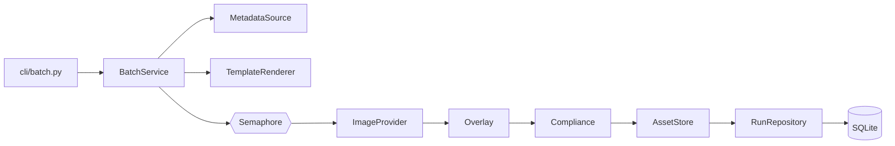

# Architecture

The authoritative, detailed description lives in `PLAN.md` at the repository root (sections 2–8). This page is the short map agents read first.

## Layers

```
src/thumbforge/
  cli/        Typer apps only; Rich rendering (cli/_render.py); error→exit mapping (cli/_errors.py)
  core/       Pydantic domain models, error hierarchy, id/hash helpers, services (hero, iterate, batch, compliance)
  providers/  ImageProvider protocol, capabilities, registry + entry points, fake.py, antigravity.py
  sources/    MetadataSource protocol; ytdlp.py (default); youtube_api.py (optional extra)
  storage/    SQLAlchemy 2.0 models, repositories, Alembic migrations, content-addressed AssetStore
  templates/  layout spec schema (TOML), Jinja2 prompt rendering, builtin templates
  imaging/    Pillow fit/crop, text overlay, YouTube compliance check, bundled font
  settings.py pydantic-settings (TOML + THUMBFORGE_* env), platformdirs paths
  logging.py  structlog configuration
```

## Dependency rule

`cli → core, storage, providers, sources, templates, imaging`. `core` imports no other internal **package**. Every other package may import `core` only. Nothing imports `cli`.

`core` is a single layer, so its own modules may import each other: `core.models` imports `core.enums`, and the Phase 6 services import `core.models`. The constraint that matters is acyclicity, so `core.enums`, `core.errors` and `core.ids` are leaves that import nothing from `core`. Enforced by import-linter contracts (Phase 1), including `core leaf modules import nothing from core`.

## Request flow (batch)



## Data model

Nine tables: `channel`, `playlist`, `video`, `playlist_item`, `template`, `provider_profile`, `run`, `iteration`, `asset`. Primary keys are 26-character Crockford base32 ULIDs (`core.ids.new_id()`), timestamps are ISO-8601 UTC strings. The SQLite engine enforces `PRAGMA journal_mode=WAL;`, `PRAGMA foreign_keys=ON;`, `PRAGMA busy_timeout=5000;` on every connection. Deterministic constraint naming conventions ensure safe Alembic batch migrations (`render_as_batch=True`). A batch run references its hero through `run.parent_run_id` and `run.reference_asset_id` (`ON DELETE RESTRICT`). Full column list and ERD: `PLAN.md` §3.

## Key decisions

| Topic                              | ADR                                                |
| ---------------------------------- | -------------------------------------------------- |
| Python 3.14 + uv                   | [0001](adr/0001-python-and-uv.md)                  |
| Typer + Rich                       | [0002](adr/0002-typer-rich-cli.md)                 |
| Settings (TOML, platformdirs)      | [0003](adr/0003-settings-toml-platformdirs.md)     |
| SQLite + SQLAlchemy + Alembic      | [0004](adr/0004-sqlite-sqlalchemy-alembic.md)      |
| yt-dlp metadata                    | [0005](adr/0005-ytdlp-metadata-source.md)          |
| Jinja2 prompts, TOML layouts       | [0006](adr/0006-jinja2-prompts-toml-layouts.md)    |
| Pillow                             | [0007](adr/0007-pillow-imaging.md)                 |
| Deterministic text overlay         | [0008](adr/0008-deterministic-text-overlay.md)     |
| ruff / pyright / pytest / prettier | [0009](adr/0009-quality-tooling.md)                |
| Provider plugins                   | [0010](adr/0010-provider-plugin-architecture.md)   |
| Content-addressed assets           | [0011](adr/0011-content-addressed-assets.md)       |
| Idempotency + resumable runs       | [0012](adr/0012-idempotency-and-resumable-runs.md) |
| Antigravity adapter                | [0013](adr/0013-antigravity-cli-adapter.md)        |
| Secrets                            | [0014](adr/0014-secrets-env-keyring.md)            |
| structlog                          | [0015](adr/0015-structlog-logging.md)              |
| zensical docs                      | [0016](adr/0016-zensical-docs-site.md)             |
